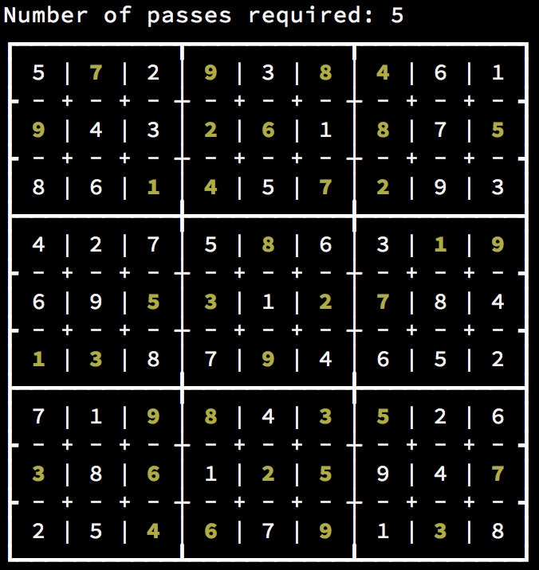
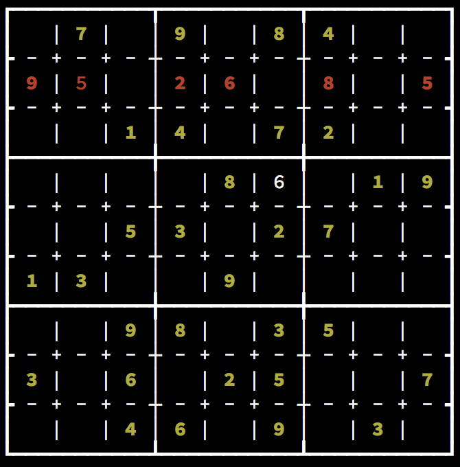

# Automated Sudoku Solver

### Usage Instructions

To automatically solve a puzzle, simply instantiate the puzzle and then call the `.solve()` method.
```
from puzzle import Puzzle

puzzle = Puzzle(' 7 9 84  9  26 8 5  14 72      8  19  53 27  13  9      98 35  3 6 25  7  46 9 3 ')
puzzle.solve()
```
Output:


To use this as a sudoku tool, instantiate the puzzle, and set square values using the `.set_square_to(row_index, col_index, value)` method. When you want to look at the puzzle, simple call `.display()`. 
```
from puzzle import Puzzle

puzzle = Puzzle(' 7 9 84  9  26 8 5  14 72      8  19  53 27  13  9      98 35  3 6 25  7  46 9 3 ')
puzzle.set_square_to(1, 1, 5)
puzzle.set_square_to(3, 5, 6)
puzzle.display()
```
Output:


It will automatically display rows, columns or boxes with invalid combinations in red. If you wish to disable this, you may call `.hide_errors()`. To begin displaying errors again, use `.show_errors()`
